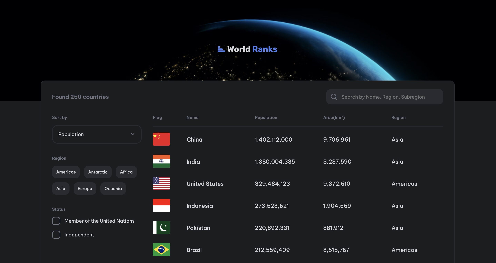

# Country Page

This is a solution to the Country Page on [devChallenges.io](https://devchallenges.io).

## Table of contents

- [Overview](#overview)
  - [Screenshot](#screenshot)
  - [Links](#links)
- [My process](#my-process)
  - [Built with](#built-with)
  - [Explanation](#explanation)
- [Credits](#credits)

## Overview

### Screenshot

This is a screenshot of the final view of the project.

### Links

- Solution URL: [https://github.com/thejxylog/country-page-react](https://github.com/thejxylog/country-page-react)
- Live Site URL: [https://country-page-react-jayl.vercel.app/](https://country-page-react-jayl.vercel.app)

## My process

### Built with

- React.js
- CSS Module
- React Query
- React Router Dom

### Explanation

Used semantic HTML5 elements, CSS Module for the design and validated form data with React Hook Form library. Select options(dropdown) are custom made which works with the help of useState. Pagination is also custom made feature.

## Credits

- Challenge site - [devChallenge.io](https://devchallenges.io/challenge/contact-page)
- Author - [Thu Nghiem](https://devchallenges.io/profile/ff6a2335-b279-4601-8927-85c85af7e7d8)
